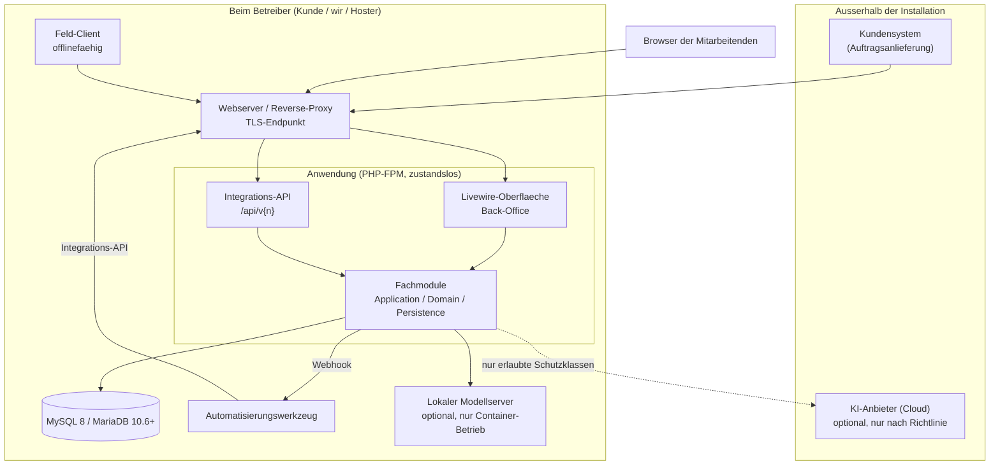

# _architecture.md — Architekturvertrag

Verbindliches Zielbild für die gemeinsame Plattform und die Produkte darauf. Dieses Dokument
steht **über** allen nachgelagerten Architektur- und Code-Leitfäden des Harness; nur die
geprüften Regeldateien gehen ihm vor (§1.2). Jede Abweichung erfordert eine dokumentierte
Architekturentscheidung (ADR, siehe §11).

Welche Produkte, Module und externen Systeme das konkret sind, steht im **Projektprofil**
(`PROJEKT.md`) und in `projekt/_domaene.md`. Dieses Dokument nennt keine Produkt- oder
Herstellernamen.

---

## 1. Geltungsbereich und Rangfolge

Dieser Vertrag gilt für jeden Quellcode aller Produkte und der Plattform. Er beantwortet
**wo etwas hingehört und was miteinander reden darf**. Wie es im Detail geschrieben wird,
regeln die nachgelagerten Dateien.

| Ebene | Datei | Zuständig für |
|---|---|---|
| Leitvertrag | `_architecture.md` (dieses Dokument) | Schichten, Module, Topologie, Grenzen, Budgets |
| Umsetzungsmuster | `_design.md` | Konkrete Datei- und Klassenmuster je Schicht |
| Persistenz | `_data.md` | Datenmodell, MySQL/MariaDB, Schlüssel, Migrationen |
| Sicherheit | `_security.md` | Anmeldung, Rechte, Audit |
| Schnittstellen | `_integration.md` | Integrations-API, Ereignisse, Automatisierungswerkzeug, Buchhaltungsübergabe, Offline-Abgleich |
| KI | `_ai.md` | Anbieterabstraktion, Schutzklassen, Freigaben |
| Code-Stil | `_code.md` | Benennung, Formatierung, Sprachgebrauch in PHP |
| Projektwerte | `PROJEKT.md` | Namen, Pfade, Modulgruppen, Zahlenwerte, Glossar |

### 1.1 Rollenbegriffe

Dieses Dokument benennt externe Bestandteile über ihre **Rolle**, nicht über ihr Produkt. Welches
Werkzeug die Rolle ausfüllt, steht im Projektprofil:

| Rolle | Bedeutung |
|---|---|
| **Automatisierungswerkzeug** | Externer Ablaufmotor für Orchestrierung und Anbindung fremder Systeme |
| **Buchhaltungsübergabe** | Export der Kontierung an die Finanzbuchhaltung des Kunden |
| **Feld-Client** | Offlinefähige Zweitanwendung außerhalb des Back-Office |
| **Kundensystem** | Fremdsystem, das Vorgänge anliefert |
| **Modellanbieter** | Anbieter von KI-Modellen, lokal oder als Dienst |

### 1.2 Rangfolge bei Widersprüchen

1. Die **Regelvorlagen** (`harness/deptrac.yaml`, `harness/phpstan.neon`,
   `harness/pint.json`) gewinnen immer — sie sind das, was tatsächlich geprüft wird
   (bestehende Harness-Regel, siehe `AGENTS.md`).
2. Danach dieses Dokument.
3. Danach die nachgelagerten Leitfäden.

Weicht eine Regeldatei von diesem Dokument ab, ist das ein Fehler in einem von beiden und
wird gemeldet, nicht stillschweigend umgangen.

---

## 2. Produktlandschaft

Eine **Plattform** und darauf aufsetzende **Produkte**, jede Einheit in einem eigenen
Repository. Die Plattform enthält rein technische Bausteine und kennt keinen Fachbegriff der
Domäne. Welche Produkte es gibt und welchen fachlichen Umfang sie haben, steht im
Projektprofil — die Plattform darf das nicht wissen.

### 2.1 Aufnahmekriterium für die Plattform

Ein Baustein gehört **nur dann** in die Plattform, wenn **alle drei** Bedingungen erfüllt
sind:

1. Mehr als ein Produkt braucht ihn oder wird ihn absehbar brauchen.
2. Er kennt keinen Fachbegriff eines Produkts.
3. Er wäre in einem weiteren, fachlich fremden Produkt unverändert einsetzbar.

Im Zweifel gehört ein Baustein **nicht** in die Plattform. Etwas später hineinzuziehen ist
billig; etwas Fachliches wieder herauszulösen ist teuer.

Das Kriterium gilt für **neue** Kandidaten. Die Bausteine in §2.2 sind mit diesem Dokument
bereits so entschieden — sie entstehen nach §2.5 ab ihrem Auslöser, auch wenn zu diesem
Zeitpunkt erst ein Produkt existiert.

### 2.2 Bestandteile der Plattform

| Baustein | Inhalt |
|---|---|
| Sicherheit | OIDC-Anmeldung, lokale Konten, Rollen- und Rechtemodell, Rechteprüfung, Notfallzugang |
| Datenzugriff-Grundgerüst | Pflichtspalten, Zeilenversion, Migrationsablauf, Abfragekonventionen |
| Nummernkreise | Vergabe je Belegart beziehungsweise Gattung, fortlaufend und nebenläufigkeitssicher |
| Audit | Revisionssichere Protokollierung |
| Ereignisse und Outbox | Domain- und Integrationsereignisse, zuverlässiger Versand, Wiederholung, Webhooks |
| Hintergrundaufträge | Warteschlange, Fortschritt, Ergebnis und Wiederaufnahme lang laufender Arbeit (§8) |
| Integrations-API-Gerüst | Versionierung, Idempotenzschlüssel, Fehlerformat, Seitenweise/Filter/Sortierung, OpenAPI |
| KI-Schicht | Anbieterabstraktion, Schutzklassen, Schwärzung, menschliche Freigabe, Protokoll und Kosten |
| Mehrsprachigkeit | Ressourcen, Übersetzungsmuster, kulturabhängige Formatierung |
| Oberflächenbibliothek | Livewire-/Blade-Komponenten und Design-Token (Umsetzung von `_uiux.md`) |
| Betriebsgrundlagen | Protokollierung mit Korrelations-ID, Health, Metriken, zentrale Fehlerbehandlung |
| Verwendungsnachweis | Register modulübergreifender Verweise, Auskunft vor dem Löschen, Konsistenzprüfung (§5.2, §6) |
| Erweiterungsfelder | Kundenspezifische Zusatzfelder an Entitäten ohne Codeänderung (`_data.md` §6.3) |
| Dokumentenablage | Unveränderliche Ablage erzeugter und externer Dokumente: Prüfsumme, Versionierung, Aufbewahrung, gemeinsame Sicherung (`_data.md` §9.4) |
| Offline-Abgleich | Abgleichsprotokoll, Idempotenz, Konfliktauflösung, Geräteregistrierung |

### 2.3 Ausdrücklich **nicht** Plattform

Geschäftspartner, Belegkopf und Belegposition, Statusfluss von Belegen, Kontierung und
Buchhaltungsübergabe liegen **je Produkt**. Das ist eine bewusste Entscheidung; sie nimmt in
Kauf, dass Fakturierung und Buchhaltungsübergabe je Produkt entstehen.

**Ausgleichende Pflicht:** Das *Muster* ist trotzdem einheitlich. Wie eine Belegposition auf
einen Buchungssatz abgebildet wird, wie Kontierung vorbelegt und überschrieben wird und wie
der Statusfluss eines Belegs aussieht, ist in `_data.md` und `_integration.md` verbindlich
beschrieben. Jedes Produkt setzt dasselbe Muster um, auch ohne geteilten Code.

Zwei Ergänzungen machen diese Pflicht durchsetzbar. **Erstens** darf der fachneutrale Kern
der Belegmechanik — Statusautomat mit den zwei Belegrollen, Durchsetzung von
Unveränderbarkeit und Positivliste, Storno-Verkettung — als Plattformbaustein entstehen,
sobald er die Kriterien aus §2.1 erfüllt; je Produkt bleiben dann die fachlichen Inhalte:
Belegarten, Felder, Kontierungslogik, Buchhaltungsübergabe. **Zweitens** wird die
Muster-Treue geprüft: `_test-strategy.md` §6 verlangt je Produkt Konformitätstests der
Belegmechanik. Ohne beides bliebe die Einheitlichkeit eine Absichtserklärung — dass zwei
Produkte auseinanderlaufen, fiele niemandem auf.

### 2.4 Auslieferung der Plattform

**Worum es geht:** Ein Produkt darf Plattformcode nicht still für sich anpassen, und zu jeder
Installation muss feststellbar sein, auf welchem Plattformstand sie läuft. Alles Folgende dient
diesen zwei Zusagen — sie sind das Prüfbare, nicht die Ablage.

- Die Plattform wird als **versionierte Pakete** veröffentlicht, **vorgezeichnet aus einem
  eigenen Repository**. Ein gemeinsames Repository für Plattform und Produkt ist zulässig, wenn
  die Pakete getrennt versioniert bleiben und das Produkt eine feste Version einbindet —
  begründet in einer **ADR**. Bei kleinen Teams ist das der Regelfall; die Trennung in zwei
  Repositories kostet dort mehr, als sie einbringt. Was sie mechanisch verhindert — die
  Plattform „mal schnell" für dieses eine Produkt zu ändern —, muss dann die ADR benennen und
  ein Konformitätstest abfangen.
- Produkte binden eine **feste Version** ein und aktualisieren bewusst.
- Versionierung nach dem üblichen dreistelligen Schema. Eine **brechende Änderung** erfordert
  einen Hauptversionssprung **und** eine ADR im Plattform-Repository.
- Jede Kundeninstallation muss einer Plattformversion zuordenbar sein; die Version wird zur
  Laufzeit über den Health-Endpunkt ausgewiesen.
- Der Harness ist ein **eigenes Repository** und wird in jedes Produkt-Repository unter
  `/harness` eingebunden (Subtree oder Submodul). Im Produkt ist er **unveränderlich**:
  Regeländerungen entstehen im Harness-Repository und werden von dort übernommen. Damit ist
  einem Produkt-Repository am eingebundenen Stand ansehbar, auf welchem Regelstand es steht.
- Projektspezifische Werte liegen **außerhalb** von `/harness` — im Projektprofil `PROJEKT.md`
  und unter `projekt/`. Wer eine Harness-Datei ändern müsste, um ein Projekt abzubilden, hat
  einen Wert am falschen Ort.

### 2.5 Ausbaustufen

Die Tabelle in §2.2 ist das Zielbild, keine Vorleistung. Kein Baustein entsteht auf Vorrat —
**ein Baustein muss stehen, sobald die erste Regel greift, die ihn voraussetzt.** Ab dann gilt
sein Vertrag vollständig; ein Provisorium im Produktcode ist auch übergangsweise unzulässig,
weil es jede Absichtserklärung überlebt, es später zu ersetzen.

| Baustein | Pflicht ab |
|---|---|
| Sicherheit (Rechteprüfung) | dem ersten Vorgang. Die OIDC-Anmeldung ab der ersten Kundeninstallation; in der Entwicklung genügen lokale Konten |
| Datenzugriff-Grundgerüst | der ersten Entität |
| Betriebsgrundlagen | dem ersten Vorgang (Fehlerbehandlung, Protokollierung); Health und Kennzahlen ab der ersten Installation |
| Mehrsprachigkeit | dem ersten Anwendertext |
| Oberflächenbibliothek | der ersten Ansicht |
| Nummernkreise | der ersten fachlichen Nummer |
| Audit | dem ersten protokollpflichtigen Vorgang (`_security.md` §5.1) |
| Ereignisse und Outbox | dem ersten Ereignis, auf das ein anderes Modul oder ein Externer reagiert |
| Hintergrundaufträge | der ersten lang laufenden Arbeit (§8) |
| Integrations-API-Gerüst | dem ersten maschinellen Zugang |
| Verwendungsnachweis | dem ersten modulübergreifenden Verweis (§5.3) |
| Dokumentenablage | dem ersten archivierten Dokument |
| Erweiterungsfelder, KI-Schicht, Offline-Abgleich | dem ersten Produktmerkmal, das sie braucht |

Was der Auslöser noch nicht verlangt, wird nicht gebaut. Was er verlangt, wird nicht im Modul
überbrückt.

---

## 3. Laufzeit-Topologie

Je **Firma** eine **eigene Installation** (`_data.md` §5). Sie läuft in einer der zwei
**gleichwertigen Betriebsformen** (`_operations.md` §4): als Container-/VM-Installation im
Haus des Kunden oder von uns als Dienst betrieben — oder auf **klassischem Webhosting**
beim Hoster des Kunden. Die Topologie ist in beiden Fällen dieselbe, nur Betreiber und
umla­gende Dienste wechseln. „Betreiber" im Bild ist der Kunde selbst, wir als Dienstleister
oder der Hoster. **Hat ein Kunde mehrere Firmen, laufen mehrere vollständig getrennte
Installationen** — eigene Anwendung, eigene Datenbank, eigener Benutzerstamm. Abgleiche und
Geschäfte zwischen ihnen laufen ausschließlich über die Integrations-API und werden je Fall
als Spec definiert (`_data.md` §5.2). Zwei Kunden sind erst recht zwei Installationen.

Bestandteile, die ein Projekt nicht braucht (Feld-Client, Automatisierungswerkzeug, lokaler
Modellserver), entfallen — die Regeln zu den übrigen bleiben unverändert gültig.

### Verbindliche Regeln

- **Die Anwendung ist zustandslos.** Sitzungen, Zwischenspeicher und Warteschlangen liegen
  außerhalb des Prozesses: Sitzungen in der **Datenbank** (Vorgabe) oder im Dateisystem,
  kein Redis-Zwang — Redis ist im Container-Betrieb erlaubt, auf Webhosting nicht
  voraussetzbar. **Eine Instanz** je Installation ist die Vorgabe, ausgelegt auf die im
  Profil festgelegte Zahl gleichzeitig offener Sitzungen (§9). Mehr-Instanz-Betrieb ist
  wegen der Zustandslosigkeit grundsätzlich möglich, erfordert aber gemeinsame Session-/
  Zwischenspeicher-Ablage und eine ADR.
- **Nur die Anwendung spricht mit der Datenbank.** Automatisierungswerkzeug,
  KI-Assistenten, Kundensysteme, Auswertungswerkzeuge und der Feld-Client greifen
  **ausschließlich** über die Integrations-API zu. Ein direkter Datenbankzugriff von außen umgeht Rechteprüfung,
  Fachregeln und Audit und ist deshalb ausnahmslos verboten.
- **Oberfläche und Integrations-API laufen in derselben Anwendung**, aber getrennt: eigenes
  Pfadpräfix `/api/v{n}`, eigene Authentifizierung (maschinelle Zugänge, nicht die
  Benutzersitzung), eigene Versionierung.
- Der Feld-Client ist eine **eigenständige Anwendung** und nutzt ausschließlich die
  Integrations-API.
- **Hintergrundarbeit läuft über die Warteschlange** (Datenbank-Treiber): dauerhafte
  Worker-Prozesse im Container-Betrieb, cron-getriggert auf Webhosting
  (`_operations.md` §4). Der Scheduler läuft über einen minütlichen Cron-Aufruf.
- Zusätzliche Infrastrukturkomponenten (weitere Datenbanken, Nachrichtenwarteschlangen-
  Server, Zwischenspeicher-Server, Suchmaschinen) erfordern eine ADR und sind nur in der
  Container-/VM-Form verfügbar — auf klassischem Webhosting gibt es **keine eigenen
  Dienste**. Wer eine solche Komponente braucht, wählt die Container-/VM-Form.

---

## 4. Schichten innerhalb eines Moduls

Jedes Fachmodul besteht aus vier Schichten:

| Schicht | Inhalt | Darf verwenden |
|---|---|---|
| **UI** | Livewire-Komponenten, Blade-Views, Anzeigezustand | Application, Oberflächenbibliothek |
| **Application** | Fachvorgänge, Anwendungsdienste, Ein-/Ausgabeverträge, Rechteprüfung, Transaktionsklammer | Domain, Persistence, Plattformdienste |
| **Domain** | Eloquent-Modelle mit Verhalten, Wertobjekte, Fachregeln, Domain-Ereignisse | **kein HTTP, keine UI, keine fremden Module** |
| **Persistence** | Migrationen des Moduls, Eloquent-Konventionen, Casts, Erzeuger | Domain |

Abhängigkeitsrichtung: `UI → Application → Domain` und `Persistence → Domain` — geprüft
durch Deptrac (`harness/deptrac.yaml`).

### 4.1 Harte Regeln

- **Die Domain-Schicht kennt kein HTTP, keine Webserver-Mechanik und keine Transport-
  Schicht.** Sie verwendet Eloquent als Abbildung — das ist Festlegung der Bauart
  (`_design.md` §3.1) —, aber keine Requests, Responses, Sessions oder Routen. Fachregeln
  sind damit ohne Webserver prüfbar (gegen die echte Datenbank, `_test-strategy.md` §5).
- **Eine Livewire-Komponente führt keine Datenbankabfrage aus.** Sie ruft einen
  Anwendungsvorgang oder eine Abfrage auf und zeigt dessen Ergebnis an.
- **Keine Fachlogik in der Oberfläche.** Maßgeblich ist die **Schicht**: Berechnung,
  Prüfung, Statusübergang und Berechtigung gehören in Application beziehungsweise Domain.
  In der UI-Schicht ist ausschließlich Anzeigelogik erlaubt — Sichtbarkeit, Formatierung,
  Eingabekomfort.
- **Clientseitige Prüfung ist Komfort, nie Autorität.** Jede Eingabeprüfung existiert
  zusätzlich im Vorgang.
- **Kein Modul greift auf die Modelle oder Tabellen eines anderen Moduls zu.**

### 4.2 Zur Bewusstheit: keine Repository-Schicht

Die Application-Schicht verwendet die Eloquent-Modelle ihres Moduls **direkt**. Es gibt
**keine** generischen Repositories, keine Unit-of-Work-Hülle und keine Schnittstelle je
Anwendungsdienst. Eloquent ist bereits Abbildungsschicht und, über `DB::transaction()`, die
Arbeitseinheit; eine weitere Hülle darüber kostet Code und verhindert das Zusammensetzen
von Abfragen.

**Schnittstellen sind dort erforderlich, wo es echte Austauschbarkeit gibt** — KI-Anbieter,
Identity-Provider, Ereignisversand, Mailversand, Zeitgeber. Diese liegen in der Plattform.
Eine Schnittstelle mit genau einer Implementierung und ohne Austauschabsicht ist ein
Regelverstoß.

Damit bleibt der Grundzug erhalten — keine Zeremonie ohne Nutzen — während die Fachlogik
einen eigenen, testbaren Ort bekommt.

### 4.3 Lesen und Schreiben

- **Lesen** projiziert innerhalb der Abfrage direkt auf den Ausgabevertrag (readonly-
  Zeilendaten). Ganze Modelle verlassen die Application-Schicht für Listen nicht.
- **Schreiben** lädt die Domain-Entität, ruft ihr Verhalten auf und speichert. Ein Vorgang
  setzt niemals Attribute einer Entität von außen, wenn dabei eine Fachregel gilt
  (`_design.md` §3.1).

---

## 5. Modulschnitt

Ein **Modul** ist ein fachlicher Kontext mit eigenem Sprachgebrauch — dort, wo derselbe
Begriff etwas anderes bedeutet, verläuft eine Modulgrenze.

### 5.1 Aufbau

- Ein Modul ist ein Verzeichnis unter der Modulwurzel mit vier Namensräumen:
  `{Kurzname}\Modules\{Modul}\Domain`, `.Application`, `.Persistence`, `.Ui`
  (`_design.md` §2).
- Ein Modul besitzt **einen eigenen Tabellenpräfix** und **einen eigenen Migrationsstrang**
  innerhalb der einen Datenbank.
- Ein Modul besitzt seine Daten allein. Niemand sonst schreibt sie.

### 5.2 Öffentliche Fläche eines Moduls

Nach außen sichtbar sind ausschließlich:

1. **Anwendungsvorgänge**, die andere Module aufrufen dürfen,
2. **veröffentlichte Ereignisse**,
3. **Leseverträge** für Daten, die andere Module anzeigen müssen,
4. **Auskunft über die Verwendung fremder Daten** — je modulübergreifendem Verweis eine
   Umsetzung, die zwei Fragen beantwortet: die **Punktauskunft** („verweist etwas in meinem
   Schema auf diese Kennung?") und die **Aufzählung** („welche fremden Kennungen dieser
   Gattung verwendet mein Schema?"). Die Punktauskunft dient dem Löschen, die Aufzählung
   speist die Konsistenzprüfung (§5.3). Sie wird beim Start am Verwendungsnachweis der
   Plattform (§6) angemeldet und läuft dort im Systemkontext (§6.1).

**Nummer 4 läuft in die Gegenrichtung, und deshalb steht sie hier.** Die ersten drei Flächen
laufen vom verweisenden zum besitzenden Modul: wer einen Verweis anlegt, fragt dort nach, ob
die Kennung existiert. Beim Löschen ist es umgekehrt — das besitzende Modul muss wissen, ob
noch jemand auf seinen Satz zeigt (`_data.md` §9.3), kennt die verweisenden Module aber nicht
und darf sie auch nicht kennen. Die Auskunft wird deshalb **über die Plattform vermittelt**:
das verweisende Modul meldet sie an, das besitzende fragt die Plattform. Beide kennen nur den
Plattformvertrag, der Abhängigkeitsgraph bleibt kreisfrei. Ein direkter Aufruf vom besitzenden
zum verweisenden Modul wäre eine Abhängigkeit, die der Modulschnitt nicht zulässt.

Alles andere — Modelle, interne Dienste, Tabellen — ist modulintern.

### 5.3 Verweise über Modulgrenzen

- Modulübergreifend wird die **Kennung** gespeichert (UUID), nicht die fremde Entität.
- **Datenbankseitige Fremdschlüssel gibt es nur innerhalb eines Moduls.** Modulübergreifend
  gibt es keinen Fremdschlüsselzwang in der Datenbank. Grund: unabhängige Migrationen und die
  Möglichkeit, ein Modul später herauszulösen.
- **Pflicht als Ausgleich:** Weil die Datenbank hier nicht schützt, prüft der schreibende
  Vorgang die Existenz der fremden Kennung, und je modulübergreifendem Verweis existiert eine
  wiederkehrende Konsistenzprüfung, die verwaiste Verweise meldet. Ohne diese Prüfung ist der
  Verweis nicht zulässig.
- **Die Konsistenzprüfung wird nicht je Verweis von Hand geschrieben.** Sie liest dasselbe
  Register wie der Verwendungsnachweis (§6), nur von der anderen Seite: über die
  **Aufzählung** jeder angemeldeten Auskunftsstelle (§5.2 Nr. 4) die verwendeten Kennungen
  sammeln und über die **Existenzauskunft** des besitzenden Moduls — je besessener Gattung
  eine Plattform-Anmeldung: „welche dieser Kennungen existieren noch?" — die verwaisten
  finden. Sie läuft im Systemkontext (§6.1). Damit ist die Prüfung eine
  Plattformleistung, und ihr **Vorhandensein** ist prüfbar —
  `_test-strategy.md` §6 verlangt zu jedem modulübergreifenden Verweis eine angemeldete
  Auskunftsstelle. Vorher war der letzte Satz oben nicht durchsetzbar: dass eine Prüfung fehlt,
  fiel niemandem auf.
- **Auskunft und Löschen sind nicht transaktional verbunden.** Zwischen einer leeren
  Punktauskunft und dem Commit des Löschens kann nebenläufig ein neuer Verweis entstehen —
  die Existenzprüfung des schreibenden Vorgangs sieht den Satz ja noch. Hartes Löschen ist
  deshalb **zweistufig** (`_data.md` §9.3): erst sperren, nach einer Karenzfrist mit erneut
  leerer Auskunft endgültig löschen.
- Eine Ausnahme von der Fremdschlüsselregel erfordert eine ADR.

### 5.4 Änderungen am Schnitt

Eine neue Modulgrenze, das Zusammenlegen oder Teilen von Modulen und das Verschieben einer
Entität zwischen Modulen erfordern eine ADR — sie sind faktisch nicht mehr umkehrbar, sobald
Kundendaten existieren.

---

## 6. Querschnittsbelange

Alle Querschnittsbelange stellt die Plattform bereit. Kein Produkt baut sie nach.

| Belang | Verbindliche Regel |
|---|---|
| **Rechte** | Jeder Vorgang prüft die Berechtigung in der **Application-Schicht**. Die Oberfläche blendet zusätzlich aus — das ersetzt die Prüfung nie. Details in `_security.md`. |
| **Nummernkreise** | Alle fachlichen Nummern kommen ausschließlich aus dem Plattformdienst, nebenläufigkeitssicher; nie selbst hochzählen. Der Geltungsbereich gehört zum Nummernkreis: je Belegart für Belege (dort **fortlaufend, Lücken selten und erklärbar**), je Gattung für Stammsätze (dort nur eindeutig). Einzelheiten in `_data.md` §7.4. |
| **Audit** | Protokollpflichtige Vorgänge werden von der Plattform aufgezeichnet, nicht vom Modul. Umfang in `_security.md`. |
| **Ereignisse** | Veröffentlichung ausschließlich über die Outbox der Plattform (§8). |
| **KI** | Zugriff nur über die KI-Schicht der Plattform, inklusive Schutzklassen und Protokoll. Kein Modul spricht direkt mit einem Modellanbieter. Details in `_ai.md`. |
| **Mehrsprachigkeit** | Kein fester Text in der Oberfläche. Alle Anwendertexte kommen aus Ressourcen; ausgeliefert werden die im Profil genannten Sprachen. Der Mechanismus bleibt für weitere Sprachen offen — auch bei nur einer ausgelieferten Sprache. Ausgaben an Dritte richten sich nach der Sprache am Geschäftspartner. |
| **Protokollierung** | Strukturiert, mit Korrelations-ID über Oberfläche, Vorgang, Datenbank und ausgehende Aufrufe hinweg. |
| **Fehlerbehandlung** | Zentral. Kein Vorgang fängt Ausnahmen, die er nicht behandeln kann. |
| **Verwendungsnachweis** | Die Frage „verweist noch jemand auf diesen Satz?" beantwortet ein Plattformbaustein, nie das Modul selbst. Je modulübergreifendem Verweis meldet das **verweisende** Modul eine Auskunftsstelle an (§5.2 Nr. 4); das **besitzende** Modul fragt vor dem Löschen die Plattform. Die Antwort trägt die Gattung des verweisenden Gegenstands als Ressourcenschlüssel, die Anzahl und Beispiele — damit die Meldung „wird in 3 Aufträgen verwendet" lauten kann statt „Löschen nicht möglich". **Beispiele nur bei Leserecht:** Gattung und Anzahl sieht jeder Löschberechtigte; Beispiele nennt die Antwort nur, wenn die fragende Person das Leserecht auf die verweisende Gattung hat. Betrifft die Auskunft Daten der höchsten Schutzklasse, ist sie leseprotokollpflichtig (`_security.md` §5.1). Dasselbe Register speist die Konsistenzprüfung aus §5.3. |
| **Erweiterungsfelder** | Kundenspezifische Zusatzfelder über den Plattformbaustein, nie durch Änderung des Produktcodes. Vertrag: `_data.md` §6.3. |

### 6.1 Ausführungskontexte

Jeder Lauf durch die Anwendung geschieht in genau **einem von drei Kontexten**. Der Kontext
bestimmt, wessen Identität in den Pflichtspalten (`_data.md` §4) und im Audit steht und
welche Rechte gelten. Ohne diese Festlegung erfindet jeder
Entwickler seinen eigenen „Systemkontext" — genau im sicherheitskritischsten Pfad.

| Kontext | Identität | Rechte |
|---|---|---|
| **Benutzersitzung** | angemeldete Person | Rechte der Person, je Vorgang geprüft |
| **Maschineller Zugang** | der Zugang (`_security.md` §4) | Rechte des Zugangs |
| **Systemkontext** | benannte Systemidentität des Plattformbausteins (Outbox-Versand, Hintergrundauftrags-Läufer, Konsistenzprüfung, …) | keine personenbezogene Prüfung; der Baustein tut ausschließlich, wofür er gebaut ist |

Verbindliche Regeln:

- **Ereignisse und Hintergrundaufträge tragen ihren Auslöser** (Person oder Zugang) aus
  dem erzeugenden Vorgang. Empfänger und Auftrag laufen im Systemkontext;
  im Audit steht die Systemidentität als Ausführende und der Auslöser zusätzlich.
- **Rechte werden beim Einreihen geprüft, nicht beim Ausführen.** Ob die auslösende Person den
  Vorgang durfte, entscheidet der erzeugende Vorgang. Ein bereits laufender Hintergrundauftrag
  läuft bei Rechteentzug zu Ende; wartende Aufträge der Person werden nicht mehr gestartet.
  Die 15-Minuten-Reprüfung (`_security.md` §1.4) gilt für Sitzungen, nicht für eingereihte
  Arbeit.
- **Modulübergreifende Aufrufe erben den Kontext des Aufrufers.** Ruft ein Vorgang einen
  Anwendungsvorgang oder Lesevertrag eines anderen Moduls, gibt es keine zweite
  personenbezogene Prüfung — maßgeblich ist das Recht des äußeren Vorgangs. Speist ein
  Lesevertrag unmittelbar eine Anzeige, prüft er ein eigenes Leserecht.

---

## 7. Vorgänge statt CRUD

Ein ERP ist vorgangsgetrieben. Die frühere Regel „genau fünf CRUD-Aktionen je Ressource"
entfällt ersatzlos.

- Ein **Fachvorgang** ist eine benannte Operation mit einem fachlichen Ergebnis — etwa
  „Auftrag bestätigen", „Lieferung buchen", „Beleg stornieren". Die Vorgänge je Modul stehen in
  `projekt/_domaene.md`.
- Ein Vorgang ist **eine Klasse** in der Application-Schicht mit einem Eingabe- und einem
  Ausgabevertrag.
- Ein Vorgang läuft in dieser Reihenfolge ab: **Recht prüfen → Eingaben prüfen
  → Fachregeln anwenden → schreiben → Ereignisse veröffentlichen**.
- **Generisches Anlegen, Ändern und Löschen** bleibt erlaubt, aber nur für Stammdatenpflege
  ohne Fachregeln.
- **Löschen** gibt es bei Belegen nicht. Ein gebuchter Beleg wird storniert, nicht entfernt
  (`_data.md`).
- Endpunkte der Integrations-API benennen den Vorgang, nicht die Tabelle:
  `POST /api/v1/sales-orders/{id}/confirm`.

**Fachregeln gehören ausschließlich in Domain und Application.** Nicht in die Oberfläche,
nicht in Datenbank-Trigger oder gespeicherte Prozeduren, nicht in Abläufe des
Automatisierungswerkzeugs und nicht in
KI-Anweisungen.

---

## 8. Transaktionen und Konsistenz

- **Eine Datenbanktransaktion je Vorgang.** Sie umfasst genau **ein Fachmodul** und die
  beteiligten Plattformbausteine — Outbox, Audit und Nummernkreise schreiben ihre eigenen
  Schemata im selben Commit über dieselbe Verbindung (`_design.md` §2.1). Verboten ist die
  gemeinsame Transaktion zweier **Fachmodule**: ein Vorgang, der zwei Module gleichzeitig
  schreiben müsste, ist falsch geschnitten.
- **Modulübergreifend gibt es keine gemeinsame Transaktion.** Die Verständigung läuft über
  Ereignisse und ist bewusst **verzögert konsistent**. Das ist eine fachliche Eigenschaft und
  muss in den Akzeptanzkriterien so beschrieben sein — nicht als technischer Nebeneffekt
  auftauchen.
- **Ereignisse werden im selben Commit in die Outbox geschrieben** wie die fachliche
  Änderung. Getrennter Versand ist verboten, weil sonst Änderung und Ereignis auseinanderfallen.
- **Jeder Ereignisempfänger ist wiederholungsfest.** Zustellung erfolgt mindestens einmal;
  doppelte Zustellung darf keine doppelte Wirkung haben.
- **Nebenläufigkeit** wird optimistisch über die Zeilenversion gelöst. Bei einem Konflikt
  bekommt die anwendende Person eine verständliche Meldung. Stilles Überschreiben ist
  verboten.
- **Lang laufende Arbeit** (Import, Export, Buchhaltungsübergabe, Massendruck, Datenübernahme)
  läuft niemals im Request einer angemeldeten Person, sondern als beobachtbarer
  Hintergrundauftrag in der Warteschlange mit Fortschritt und Ergebnis.

---

## 9. Leistungsbudgets

Verbindliche Zielwerte je Kundeninstallation. Eine Verletzung ist ein Fehler, kein
Verbesserungsvorschlag.

Die Zahlenwerte sind **Vorgaben des Harness**. Ein Projekt darf sie unter `[budgets]` im
Profil abweichend festlegen; dann gilt der Profilwert. Ohne Eintrag gilt die Vorgabe hier.

**Festlegen ist keine Abweichung.** Ein Profilwert braucht **keine ADR** — er ist die
Entscheidung, welcher Wert für dieses Produkt gilt, und steht nachvollziehbar im Profil.
ADR-pflichtig ist nach §11 erst, wenn der **geltende** Wert bewusst nicht eingehalten wird:
eine Abfrage, die die 300 ms überschreitet und so bleibt. Das ist der Unterschied zwischen
„hier gilt eine andere Zahl" und „hier wird die geltende Zahl gebrochen".

| Größe | Zielwert |
|---|---|
| Gleichzeitig offene Sitzungen | `[budgets] sitzungen`, Vorgabe 300 auf einer Instanz |
| Gleichzeitig offene Sitzungen **je Konto** | `[budgets] sitzungenJeKonto`, Vorgabe 3; 1 ist unzulässig (`_security.md` §1.4) |
| Serverseitige Bearbeitung einer Interaktion (ohne Listen- und Berichtsabfragen) | 95 % ≤ 200 ms, 99 % ≤ 500 ms |
| Listen- und Berichtsabfrage inklusive Datenbank, Standardseitengröße | 95 % ≤ 300 ms |
| Erster Seitenaufbau nach Anmeldung | ≤ 2 s |
| Arbeitsspeicher je Serveranfrage | ≤ 64 MB im Mittel |

**Messpunkt:** vom Eintreffen der Interaktion beim Server bis zum Abschluss der
serverseitigen Verarbeitung; die Netzlaufzeit zum Browser zählt nicht mit. Eine Interaktion,
deren Kern eine Listen- oder Berichtsabfrage ist, wird **gegen das Listenbudget** gemessen —
nie gegen beide Zeilen zugleich.

### Daraus folgende Regeln

- **Keine Abfrage ohne Obergrenze.** Standardseitengröße 50, Höchstwert 200. Ein Endpunkt
  oder eine Ansicht, die „alles" liefert, ist ein Regelverstoß — unabhängig davon, wie klein
  die Tabelle heute ist.
- **Kein N+1.** Benötigte Verknüpfungen werden in der Abfrage aufgelöst, Ergebnisse direkt
  auf den Ausgabevertrag projiziert.
- **Jede Such- und Filterspalte ist indiziert.** Führende Platzhalter in Suchmustern sind ohne
  Volltextindex verboten.
- **Der Sitzungszustand bleibt klein.** Große Ergebnismengen gehören nicht in den Zustand
  einer Komponente; große Tabellen werden virtualisiert dargestellt.
- **Die Obergrenze gleichzeitiger Datenbankverbindungen ist festgelegt** und dokumentiert —
  sie leitet sich aus der Zahl der PHP-FPM-Worker je Instanz ab. Ein Vorgang hält keine
  Verbindung über Wartezeiten hinweg.
- **Nachweis vor Auslieferung:** Ein Lasttest mit der im Profil festgelegten Sitzungszahl
  gehört zur Freigabe einer Version (`_operations.md`).
- **Hardware-Empfehlung an den Kunden** wird aus diesen Budgets abgeleitet und mit jeder
  Version überprüft.

---

## 10. Erweiterbarkeit

### 10.1 Ein neues Modul

Entsteht immer nach demselben Muster: vier Namensräume (§4), eigener Tabellenpräfix,
eigener Migrationsstrang, Anschluss an die Querschnittsbelange der Plattform (§6). Das
konkrete Dateimuster steht in `_design.md`.

### 10.2 Kundenspezifische Anpassungen

Kunden bekommen **keinen abgespaltenen Code**. Es gibt keine kundenspezifischen Zweige und
keine kundenspezifischen Klassen im Produkt. Zulässig sind ausschließlich:

- **Konfiguration** — Schalter, Grenzwerte, Vorbelegungen, Belegvorlagen, Textbausteine,
  Nummernkreise,
- **Erweiterungsfelder** an Entitäten über den Plattformbaustein,
- **Abonnements auf Ereignisse**, ausgeführt im Automatisierungswerkzeug,
- **eigene Abläufe im Automatisierungswerkzeug** gegen die Integrations-API.

Was so nicht abbildbar ist, wird zum Produktmerkmal für alle — oder es wird nicht gebaut.
Diese Regel ist der Grund, warum Software beim Kunden im Haus überhaupt wartbar bleibt.

### 10.3 Grenze zum Automatisierungswerkzeug

Das Automatisierungswerkzeug **orchestriert**, es **entscheidet nicht**. Erlaubt sind
Ablaufsteuerung, Benachrichtigung,
Datentransport und die Anbindung fremder Systeme. Verboten sind Fachregeln, Berechnungen und
Prüfungen — die gehören in Application und Domain, damit sie testbar, versioniert und
nachvollziehbar bleiben.

---

## 11. Wann eine ADR nötig ist

Eine Architekturentscheidung wird nach `_documentation.md` dokumentiert bei:

- neuer, geänderter, zusammengelegter oder geteilter **Modulgrenze**,
- **Abweichung von den Schichtregeln** aus §4,
- **modulübergreifendem Fremdschlüssel** in der Datenbank,
- **Mehr-Instanz-Betrieb** oder anderer Abweichung von der Topologie aus §3,
- **zusätzlicher Infrastrukturkomponente**,
- **bewusster Verletzung eines geltenden Leistungsbudgets** aus §9 — nicht schon beim
  Festlegen eines abweichenden Profilwerts, siehe §9,
- **brechender Änderung** an der Integrations-API oder an einem Plattformpaket,
- **Austausch eines Querschnittsbausteins** aus §6.

Eine ADR beschreibt Kontext, Entscheidung, Konsequenzen und die verworfenen Alternativen. Sie
wird **vor** der Umsetzung geschrieben, nicht danach.

---

## 12. Verbotsliste

Kurzfassung zum Prüfen. Jeder Punkt ist an anderer Stelle dieses Dokuments begründet.

1. Zugriff auf die Datenbank von außerhalb der Anwendung.
2. Datenbankabfrage in einer Livewire-Komponente oder Blade-View.
3. Fachregel, Berechnung oder Berechtigungsentscheidung in der UI-Schicht.
4. HTTP-, Sitzungs- oder Routing-Mechanik sowie fremde Modul-Namensräume in der
   Domain-Schicht.
5. Zugriff auf Modelle oder Tabellen eines fremden Moduls.
6. Datenbankseitiger Fremdschlüssel über Modulgrenzen hinweg (ohne ADR).
7. Abfrage oder Endpunkt ohne Obergrenze der Ergebnismenge.
8. Selbst hochgezählte Belegnummern.
9. Hartes Löschen eines gebuchten Belegs.
10. Ereignisversand außerhalb der Outbox.
11. Gemeinsame Transaktion zweier Fachmodule. (Plattformbausteine schreiben im selben
    Commit wie das Fachmodul — das ist Pflicht, §8.)
12. Generisches Repository, Unit-of-Work-Hülle oder Schnittstelle ohne Austauschabsicht.
13. Fester Anwendertext in der Oberfläche.
14. Fachregel in Datenbank-Trigger, gespeicherter Prozedur, Ablauf des
    Automatisierungswerkzeugs oder KI-Anweisung.
15. Direkter Aufruf eines KI-Anbieters unter Umgehung der Plattform-KI-Schicht.
16. Kundenspezifischer Zweig oder kundenspezifische Klasse im Produktcode.
17. Mehr als eine Firma — und erst recht mehr als ein Kunde — in einer Installation oder
    Datenbank (`_data.md` §5).
18. Abgleich oder Geschäft zwischen zwei Installationen an der Integrations-API vorbei
    (`_data.md` §5.2).

---

## Verweise

- Umsetzungsmuster je Schicht: `_design.md`, geprüft über `harness/deptrac.yaml`
- Datenmodell und MySQL/MariaDB: `_data.md`
- Anmeldung, Rechte, Audit: `_security.md`
- Integrations-API, Ereignisse, Automatisierungswerkzeug, Buchhaltungsübergabe,
  Offline-Abgleich: `_integration.md`
- KI-Funktionen: `_ai.md`
- Teststrategie: `_test-strategy.md`, `_test-api.md`, `_test-ui.md`
- Betrieb, Beobachtbarkeit, Lasttest: `_operations.md`
- Oberflächengestaltung: `_uiux.md`
